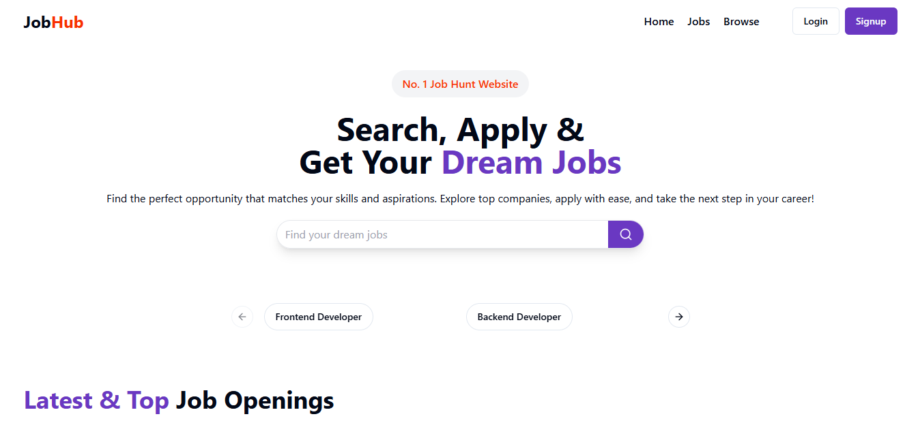

# JobHub  
### A Modern Job Portal for Recruiters & Job Seekers

JobHub is a **full-stack Job Portal application** built using the **MERN Stack**, designed to simplify the hiring process for recruiters and make job searching seamless for applicants.

The platform provides **two dedicated panels** - one for **recruiters** to manage companies, jobs, and applicants, and another for **job seekers** to explore opportunities, apply for jobs, and track application status.

JobHub is fully **responsive**, ensuring a smooth experience across desktop, tablet, and mobile devices.

---

##  Overview

JobHub acts as a centralized platform connecting **talent and recruiters**.  
Recruiters can post jobs, manage applicants, and track hiring progress, while candidates can browse jobs, apply easily, and manage their profiles.

The project focuses on **real-world hiring workflows**, role-based access, and clean UI/UX.

---

##  Tech Stack

### Frontend
- **React.js** – Component-based UI development
- **Tailwind CSS** – Responsive and modern styling
- **ShadCN UI** – Accessible and reusable UI components
- **Redux Toolkit** – State management
- **React Router** – Client-side routing

### Backend
- **Node.js** – JavaScript runtime
- **Express.js** – REST API framework
- **MongoDB** – NoSQL database
- **Mongoose** – ODM for MongoDB

### Authentication & Utilities
- **JWT Authentication** – Secure login and authorization
- **Cloudinary** – Resume and image uploads
- **Axios** – API communication

---

##  Features

###  Recruiter Panel
- Register and manage companies
- Post, update, and delete job listings
- View and manage applicants
- Accept or reject applications
- Role-based protected routes

###  Applicant Panel
- User authentication and profile management
- Browse and search jobs
- Apply to jobs with resume upload
- Track applied jobs and application status
- Update profile, skills, and resume

###  Authentication & Security
- Secure JWT-based authentication
- Role-based access control
- Protected routes for recruiters

###  Responsive Design
- Fully responsive across all devices
- Mobile-friendly navigation and layouts

---

##  Roles & Permissions

| Role       | Description |
|------------|------------|
| Applicant  | Can browse jobs, apply, manage profile and resume |
| Recruiter  | Can create companies, post jobs, and manage applicants |

---

##  Integration Ready

JobHub is designed to integrate with external platforms like **EduWizard** and **Avia AI**, enabling users to:
- Learn skills on EduWizard
- Prepare resumes and interviews on Avia AI
- Apply for jobs seamlessly on JobHub

This creates a **complete learning-to-hiring ecosystem**.

